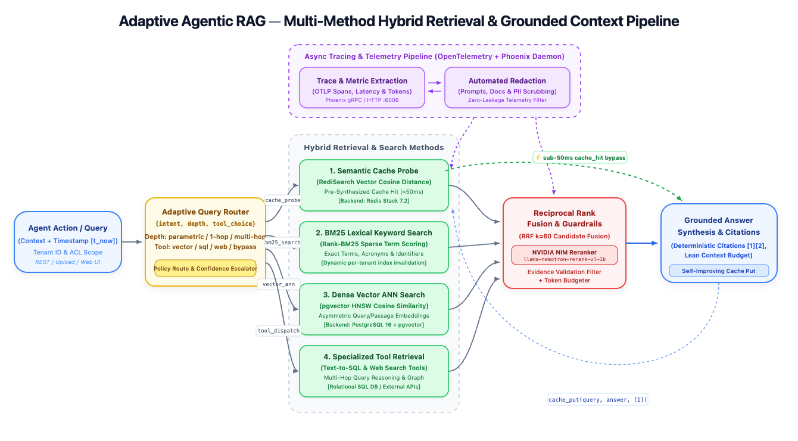

# Adaptive Agentic RAG V1

<p align="center">
  <strong>Autonomous Multi-Tier Hybrid Retrieval, Semantic Caching & Grounded Context Synthesis</strong>
</p>

<p align="center">
  
  
  
  
  
  
  
</p>

---

## 🏛️ System Architecture

<p align="center">
  
</p>

The **Adaptive Agentic RAG** engine combines dynamic query routing, multi-method hybrid retrieval, reciprocal rank fusion (RRF), neural cross-encoder re-ranking, and high-speed semantic vector caching with end-to-end OpenTelemetry tracing.

### Architectural Breakdown

```
[ Client Query / Ingestion ]
           │
           ▼
[ Adaptive Query Router ] ──── {intent, depth, tool_choice}
     │           │             │            │
cache_probe  bm25_search  vector_ann  tool_dispatch
     │           │             │            │
     ▼           ▼             ▼            ▼
┌────────────────────────────────────────────────────────┐
│          Hybrid Retrieval & Search Methods             │
│  1. Semantic Cache Probe (RediSearch Vector <50ms)     │
│  2. BM25 Lexical Keyword Search (Rank-BM25 Sparse)     │
│  3. Dense Vector ANN Search (pgvector HNSW Cosine)     │
│  4. Specialized Tool Retrieval (Text-to-SQL & Web)     │
└────────────────────────────────────────────────────────┘
     │           │             │            │
     └───────────┼─────────────┴────────────┘
                 ▼
┌────────────────────────────────────────────────────────┐
│     Reciprocal Rank Fusion (RRF) & Neural Reranker     │
│   • RRF Candidate Merging (k=60)                       │
│   • NVIDIA NIM Cross-Encoder (Nemotron-Rerank-VL-1B)   │
│   • Evidence Validation & Token Budget Guardrails      │
└────────────────────────────────────────────────────────┘
                 │
                 ▼
[ Grounded Answer Synthesis & Citations [1][2] ] ──► (cache_put)
```

1. **Client Action / Query**: Tenant-scoped payloads arrive via REST API, file upload, or CLI with authenticated access control lists (`ACL`), request context timestamps, and token budgets.
2. **Adaptive Query Router**: Inspects query intent, complexity, and domain scope to determine execution depth (`parametric`, `single_hop`, `multi_hop`) and tool choice (`vector`, `sql`, `web`, `parametric`), with policy-driven confidence escalation.
3. **Hybrid Retrieval & Search Methods**:
   - **Method 1: Semantic Cache Probe**: High-velocity RediSearch vector cosine distance check. If similarity meets `CACHE_SIMILARITY_THRESHOLD`, queries achieve a **sub-50ms cache hit**, immediately bypassing downstream retrieval and synthesis.
   - **Method 2: BM25 Lexical Keyword Search**: Exact-match keyword scoring using `rank-bm25`. Crucial for identifiers, error codes, and domain acronyms. Indexes are dynamically invalidated per tenant upon document ingestion.
   - **Method 3: Dense Vector ANN Search**: High-recall semantic vector similarity powered by PostgreSQL with `pgvector` HNSW indexes and asymmetric embeddings (`input_type="passage"` for ingestion, `"query"` for retrieval).
   - **Method 4: Specialized Tool Retrieval**: Structured Text-to-SQL queries against relational databases, live Web Search tool execution, or multi-hop agentic graph traversal when deep reasoning is needed.
4. **Reciprocal Rank Fusion & Neural Reranker**:
   - Fuses ranked candidate lists from lexical and dense searches via Reciprocal Rank Fusion (`RRF k=60`).
   - Re-ranks top candidates using the **NVIDIA NIM Cross-Encoder** (`nvidia/llama-nemotron-rerank-vl-1b-v2`).
   - Applies evidence validation filters and strictly enforces context token budgets (`RETRIEVAL_CONTEXT_TOKEN_BUDGET`).
5. **Grounded Answer Synthesis**: Context assembly feeds into the generation engine (Meta LLaMA 3.1 8B Instruct / OpenAI GPT-4o-mini), enforcing strict inline evidence citations (`[1]`, `[2]`). Newly synthesized answers are asynchronously cached in Redis for future hits.
6. **Observability & Feedback Loop**: Continuous OTLP span collection via **Ariadne Phoenix**, profiling latency, token consumption, and retrieval quality, protected by an automated zero-leakage prompt and PII redaction filter.

---

## ⚡ Key Capabilities

- **Hybrid Lexical & Semantic Retrieval**: Seamlessly blends BM25 keyword precision with dense embedding recall, optimized via Reciprocal Rank Fusion (RRF).
- **Sub-50ms Semantic Caching**: Employs RediSearch vector indexes in Redis Stack to eliminate duplicate LLM calls and reduce latency by up to 90%.
- **Neural Cross-Encoder Re-Ranking**: Hosted NVIDIA NIM re-ranking (`llama-nemotron-rerank-vl-1b-v2`) with automatic order-preserving fallbacks.
- **Dynamic Index Invalidation**: Automatically updates tenant BM25 lexical caches upon ingestion completion, eliminating stale read states.
- **Provider Redundancy & Resilient Fallbacks**: Unified interfaces for NVIDIA NIM and OpenAI for embeddings, re-ranking, and text generation.
- **Deterministic Inline Citations**: Context assembly ensures generated responses cite source documents directly (`[1]`, `[2]`), mapping chunk IDs back to source documents.
- **Multi-Tenant Isolation**: Tenant-scoped database queries, Redis vector indexes, and access control contexts (`RequestContext`).
- **Interactive Web Dashboard**: Built-in visual console at `/dashboard` for testing document ingestion, real-time job tracking, and hybrid query verification.
- **Privacy-First Observability**: Full OTLP tracing to Ariadne Phoenix with redaction filters for prompts, documents, and credentials.

---

## 🛠️ Technology Stack

| Domain | Technology | Purpose |
| :--- | :--- | :--- |
| **API & Framework** | FastAPI, Uvicorn, Pydantic v2 | High-throughput asynchronous REST API |
| **Relational Database** | PostgreSQL 16 + `pgvector` | Chunk storage, metadata, and HNSW vector similarity |
| **Semantic Cache** | Redis Stack 7.2 (RediSearch) | Vector-similarity caching with cosine distance |
| **Search Engine** | OpenSearch 2.11 & Rank-BM25 | Inverted index lexical search & multi-tenant indexing |
| **Neural Models** | NVIDIA NIM / OpenAI | Nemotron embeddings, LLaMA 3.1 8B, Nemotron Rerank |
| **Observability** | Ariadne Phoenix, OpenTelemetry | OTLP distributed tracing, token profiling, latency metrics |
| **Migrations & ORM** | SQLAlchemy 2.0, Alembic | Declarative database schema and version control |

---

## 🚀 Quick Start

### Prerequisites

- [Docker](https://docs.docker.com/get-docker/) & [Docker Compose](https://docs.docker.com/compose/)
- Python 3.11+ and [`uv`](https://github.com/astral-sh/uv) (for local CLI development)
- NVIDIA NIM API Key or OpenAI API Key (optional for mock/deterministic tests)

### 1. Configure Environment

Copy the example configuration:

```bash
cp .env.example .env
```

Set your model provider credentials in `.env` (e.g. `NIMS_API_KEY` or `OPENAI_API_KEY`):

```dotenv
NIMS_API_KEY=nvapi-your-key-here
NIMS_EMBEDDING_MODEL=nvidia/llama-nemotron-embed-vl-1b-v2
NIMS_GENERATION_MODEL=meta/llama-3.1-8b-instruct
NIMS_RERANK_MODEL=nvidia/llama-nemotron-rerank-vl-1b-v2

# Semantic Cache
CACHE_ENABLED=true
CACHE_SIMILARITY_THRESHOLD=0.15
REDIS_HOST=redis
REDIS_PORT=6379
```

### 2. Launch Local Stack

Start all services with Docker Compose:

```bash
docker compose up --build
```

The stack provisions:
- **FastAPI Core**: [http://localhost:8000](http://localhost:8000)
- **Interactive Dashboard**: [http://localhost:8000/dashboard](http://localhost:8000/dashboard)
- **API Documentation**: [http://localhost:8000/docs](http://localhost:8000/docs)
- **Ariadne Phoenix Tracing**: [http://localhost:6006](http://localhost:6006)
- **OpenSearch**: [http://localhost:9200](http://localhost:9200)
- **PostgreSQL (pgvector)**: `localhost:5432`
- **Redis (RediSearch)**: `localhost:6379`

To shut down the stack:
```bash
docker compose down
# Use -v only if you intentionally wish to erase local database volumes:
docker compose down -v
```

---

## 📡 API Usage Examples

### 1. Ingest Documents

#### Option A: Submit Raw Content
```bash
curl -X POST http://localhost:8000/v1/ingestion \
  -H "Content-Type: application/json" \
  -H "x-tenant-id: default" \
  -d '{
    "filename": "rag_overview.md",
    "content": "Adaptive Agentic RAG pairs BM25 lexical search with pgvector dense similarity, re-ranking candidates using NVIDIA NIM cross-encoders.",
    "source_type": "upload",
    "metadata": {"category": "architecture"}
  }'
```

#### Option B: Upload a File
```bash
curl -X POST http://localhost:8000/v1/ingestion/upload \
  -H "x-tenant-id: default" \
  -F "file=@sample_document.txt" \
  -F 'metadata={"author":"admin"}'
```

#### Check Ingestion Job Status
```bash
curl http://localhost:8000/v1/ingestion/<JOB_ID>
```

### 2. Query the Engine

#### Hybrid Retrieval with Grounded Answer Synthesis
```bash
curl -X POST http://localhost:8000/v1/queries \
  -H "Content-Type: application/json" \
  -H "x-tenant-id: default" \
  -d '{
    "query": "How does Adaptive RAG handle re-ranking and caching?",
    "limit": 5,
    "generate": true
  }'
```

**Response**:
```json
{
  "query": "How does Adaptive RAG handle re-ranking and caching?",
  "answer": "Adaptive RAG utilizes a Redis RediSearch vector cache for sub-50ms semantic retrieval [1]. When cache misses occur, candidates from BM25 and dense stages are fused and re-ranked using an NVIDIA NIM cross-encoder [2].",
  "citations": [
    {
      "citation_index": 1,
      "document_id": "doc_9281a",
      "chunk_id": "chk_0392f"
    },
    {
      "citation_index": 2,
      "document_id": "doc_9281a",
      "chunk_id": "chk_0393a"
    }
  ],
  "cache_status": "miss",
  "trace_id": "93a02fe812bc"
}
```

Subsequent identical or semantically similar queries return `"cache_status": "hit"` in `<50ms`.

---

## 🖥️ Interactive Web Dashboard

Access the built-in control dashboard at **`http://localhost:8000/dashboard`**:

- **Document Uploader**: Drag & drop or upload text and markdown files with custom JSON metadata.
- **Ingestion Job Tracker**: Real-time progress monitoring through `parsing`, `normalization`, `chunking`, and `embedding` stages.
- **Adaptive Query Playground**: Test hybrid search with toggles for generation and configurable result limits.
- **Citation & Cache Badges**: Inspect generated answers, grounded citations, latency profiles, and cache hit/miss indicators.

---

## 🧪 Development & Quality Assurance

Run the test suite and static analysis locally using `uv`:

```bash
# 1. Synchronize dependencies
uv sync --frozen --all-groups

# 2. Code formatting & linting
uv run ruff check .
uv run ruff format --check .

# 3. Static type validation
uv run mypy adaptive

# 4. Unit & integration test execution
uv run pytest tests -q

# 5. Smoke test Compose configuration
docker compose config
uv run pytest tests/smoke -q

# 6. Verify Docker build
docker build --target runtime -t adaptive-rag:local .
```

---

## 📂 Project Structure

```
.
├── adaptive/
│   ├── api/               # FastAPI endpoints, schemas, authentication, and dashboard
│   ├── cache/             # Redis RediSearch semantic vector cache store and service
│   ├── db/                # SQLAlchemy models, repositories, and connection sessions
│   ├── eval/              # RAG benchmarking, dataset sweeps, and metric evaluation
│   ├── graph/             # Agentic graph workflows and subgraph definitions
│   ├── guardrails/        # Evidence validation, token budgeters, and safety filters
│   ├── ingestion/         # Document parsing, normalization, chunking, and pipeline
│   ├── observability/     # OpenTelemetry configuration, span tracing, and redactors
│   ├── providers/         # NVIDIA NIM and OpenAI embedding, generation, & rerankers
│   ├── retrieval/         # BM25 lexical stage, NeonDB pgvector stage, and RRF fusion
│   ├── routers/           # Adaptive policy routers and model escalation handlers
│   ├── config.py          # Pydantic v2 application configuration and environment settings
│   └── interfaces.py      # Core domain models, protocols, and data contracts
├── alembic/               # Database migrations for schema evolution
├── docs/
│   ├── assets/            # Architecture diagrams (SVG & PNG)
│   ├── architecture.md    # In-depth architectural design specification
│   └── runbooks/          # Incident response and local deployment operational runbooks
├── tests/                 # Unit, integration, and smoke test suites
├── docker-compose.yml     # Local multi-service infrastructure definition
├── Dockerfile             # Multi-stage container build definition
└── pyproject.toml         # Project dependencies and tool configurations
```

---

## 📄 License

This project is licensed under the [MIT License](LICENSE).
